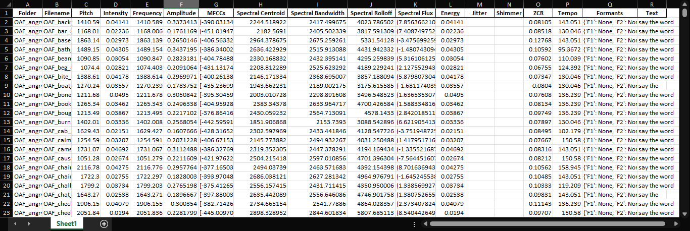
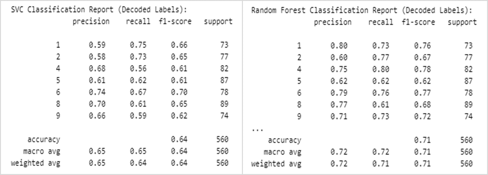
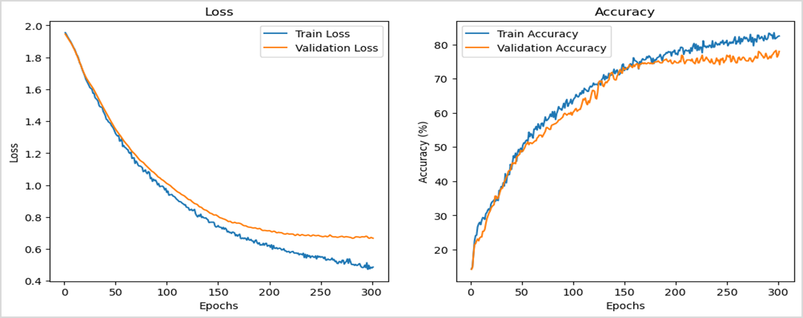
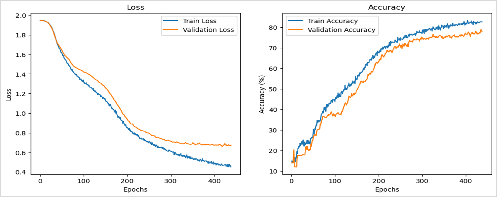
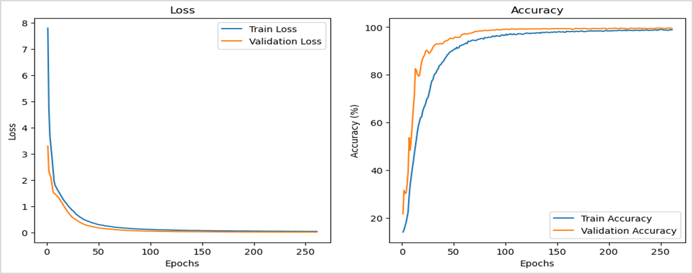
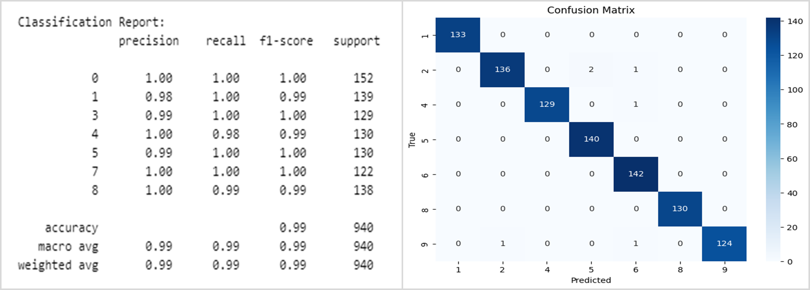

# **Stress Level Detection**
`A Comparison Study of Statistical ML Model vs Pre-difined CNN Model vs Proposed (LSTM+CNN) Model.`

### **Aim of this Study:**
- Propose an optimal multi-modal deep learning approach for stress level detection.
- Compare my proposed model with a well stablished CNN model and one of two Statistical (Traditional) ML models.

### **Approach of this Study:**
- **A Suitable Dataset:** Tononto Emotional Speech Set (TESS) dataset includes almost all the common emotions of a human, emotionally rich and semantically neutral utterances and high audio quality data.
- **Suitable Models to Train:**
    - Statistical (ML) Models: I select SVM and Random Forest to train on my dataset and further choose best one.
    - CNN Model: StressCNN model is published in December 2021 for Stress Classification. It is simple yet powerful architecture for capturing spatio-temporal patterns from audio, robustness to noise, scalability, and adaptability to stress-specific acoustic features.
    - Proposed (LSTM+CNN) Model: Here I use a combination of lstm and cnn architecture.
    - `why this (lstm+cnn) combination?`
        - lstm is designed to handle sequential data, so it will ensure the sequential relationships over time. capturing temporal dependencies like - stress-related changes (e.g., in pitch, tone, or energy) are very crucial for stress level detection.
        - cnn can isolate local patterns and also very suitable to capture instantaneous features. (will be helpful because our audio files are (1-3) sec long).
        - lstm and cnn combination is flexible for multimodal extension where lstm will provide context that pure CNNs might miss and will create a base for incorporating modalities (e.g., physiological signals, text), making it easier to extend the model for future applications.
- **Combination of Approaches:**
    - Train all the three models on Feature Dataset.
    - Train all the three models on Raw Audio Dataset.
    - Train all the three models on Combined Audio and Feature Dataset.

## **Dataset**

### **TESS (Tononto Emotional Speech Set) Dataset**
- The primary dataset is collected from Kaggle [[Dataset Link]](https://www.kaggle.com/datasets/ejlok1/toronto-emotional-speech-set-tess)

**Key Features:**
- Includes recordings from two female native English speakers: aged 26 and 64 years.
- The dataset captures seven emotions: `Neutral`, `Angry`, `Happy`, `Sad`, `Disgust`, `Fear`, and `Pleasant Surprise`.
- Each emotion is expressed using 200 target words, producing emotionally rich and semantically neutral utterances.
- The recordings are provided in 16-bit WAV format with a sampling rate of 44.1 kHz, ensures high audio quality suitable for acoustic analysis.
### **Making of Feature Dataset**
- Essential Features for Stress Detection:
    - Prosodic Features: Pitch, Energy / Intensity
    - Spectral Features: Mel-Frequency Cepstral Coefficients (MFCCs), Spectral Centroid, Spectral Flux, Spectral Bandwidth, Spectral Roll-Off
    - Voice Quality Features: Harmonics-to-Noise Ratio (HNR), Formants (F1, F2, F3)
    - Temporal Features: Frequency, Speech Rate
    - Derived Features: Chroma
- For comparison with cnn and proposed (lstm+cnn) model a feature dataset is needed for traditional machile learning models. This dataset is used to train all the models for one of out three sections of comparison.
- `librosa` and `parselmouth` both are python libraries used to extract features from audio file.
    - librosa extracted features like - Pitch, Intensity, Frequency, Amplitude, MFCCs, Spectral - (Centroid, Bandwidth, Rolloff, Flux), Energy, ZCR, Tempo, Formants.
    - perselmouth extracted features like - Jitter and Shimmer [These valuses were null, they were removed]
    
    **Dataset with all Extracted Features**

    

- Use GPT-4.0 to project emotions into `stress level` from 1 to 10. This stress level is the output (target) for the comparison study on only feature dataset. 

    

    **Final Feature Dataset**

    

## **Approach-1: Train Models on Feature Dataset**
- #### **ML Model:** SVM and Random Forest
    - Final Accuracy:
        - SVM           : 64%
        - Random Forest : 71%
    - Classification Reports:

    

    - Confussion Matrices:

    

- #### **CNN Model:** (StressCNN)
    - Input Layer: accept 1d signals as input
    - Two Convolutional Layers: `Conv1d` layers with 32 and 64 filters respectively, a kernel size of 3, and padding of 1, followed by a ReLU activation function.
    - Pooling Layers: Each convolutional layer is followed by a MaxPool1d layer with a kernel size of 2 to reduce the spatial dimensions.
    - Fully Connected Layers: A Linear layer with 128 neurons, followed by a ReLU activation function.
    - Droopout Layer: A dropout layer with a 0.5 rate to reduce overfitting.
    - Output Layer: A Linear layer with 9 neurons (matching the number of classes).

        

    - Final Accuracy: 75%

    - Accuracy vs Loss Curve:

        

    - Classification Report and Confussion Matrix:

        

- #### **Proposed Model:** (LSTM+CNN)
    - Input Layer: Accepts 1D sequential data with a specified number of features (input_dim).
    - LSTM Layer: A bidirectional LSTM with hidden_dim units, lstm_layers layers, capturing temporal dependencies in both directions.
    - Convolutional Layer: A 1D Conv1d layer with hidden_dim * 2 input channels, cnn_channels filters, kernel size 3, padding 1, followed by a ReLU activation function.
    - Global Average Pooling Layer: An adaptive average pooling layer that reduces feature maps to a fixed size.
    - Fully Connected Layers: A Linear layer with 128 neurons, followed by a ReLU activation function.
    - Dropout Layer: A dropout layer with a 0.5 rate to reduce overfitting.
    - Output Layer: A Linear layer with num_classes neurons, producing the final output.

        

    - Final Accuracy: 77%

    - Accuracy vs Loss Curve:

        

    - Classification Report and Confussion Matrix:

        

*`These model architectures will be used for our all approaches.`*

## **Approach-2: Train Models on Audio Dataset**
- #### **ML Model:** SVM and Random Forest
- Since traditional ML models need feature data, we use `OpenSMILE` to extract features automatically and then train the models on these features.
- OpenSMILE Process:

    - Final Accuracy:
        - SVM           : 99%
        - Random Forest : 100%
    
    - Classification Reports:

    

    - Confussion Matrices:

    

- #### **CNN Model:** (StressCNN)
    - Final Accuracy: 75%

    - Accuracy vs Loss Curve:

        

    - Classification Report and Confussion Matrix:

        

- #### **Proposed Model:** (LSTM+CNN)
    - Final Accuracy: 77%

    - Accuracy vs Loss Curve:

        

    - Classification Report and Confussion Matrix:

        
